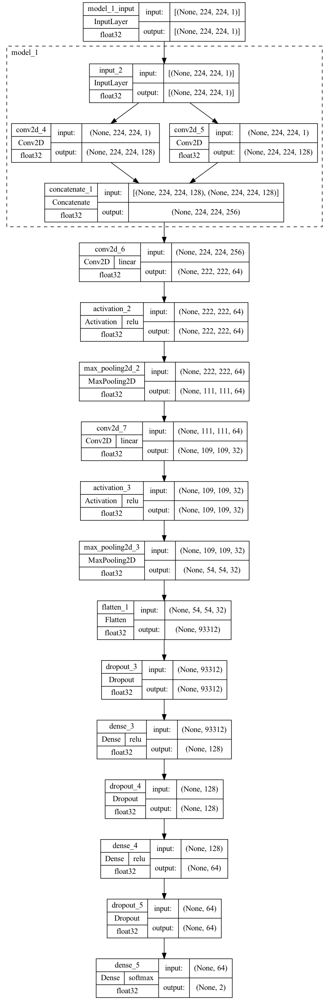
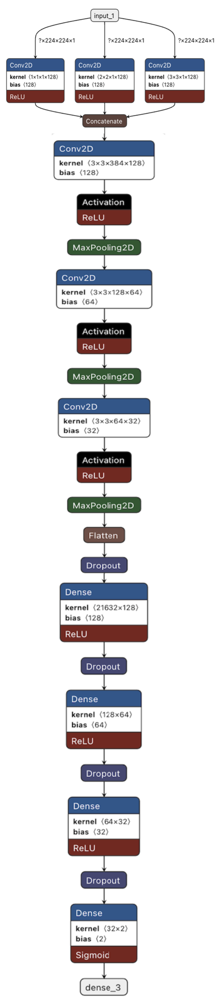
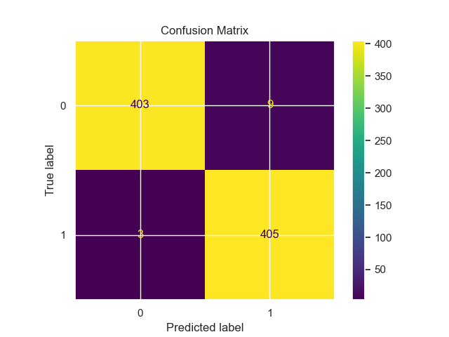

# CharithaNet: COVID-19 Identification with Chest X-Ray

CharithaNet is a deep learning project for identifying COVID-19 pneumonia from chest X-ray images using convolutional neural networks (CNNs). This repository includes multiple experiment notebooks, environment setup, figures, and the associated paper.

## Repository Contents
- Notebooks: iterative experiments and model versions
  - `covid-19-identification-with-chest-x-ray-v1.ipynb`
  - `covid-19-identification-with-chest-x-ray-v2.ipynb`
  - `covid-19-identification-with-chest-x-ray-v3.ipynb`
  - `covid-19-identification-with-chest-x-ray-v4.ipynb`
  - `covid-19-identification-with-chest-x-ray-v5.ipynb`
- Paper: `1-CJMR_Vol_08_1_and_2_Diagnostic-of-COVID-19-Pneumonia-through-Convolutional-Neural-Networks-Using-Chest-X-RAY.pdf`
- Environment spec: `requirment_for_project.yml`
- Figures: `model.png`, `model-ar-view-graphical.png`, `confusion_matrix.png`
- License: `LICENSE`

## Paper (PDF)
- View on GitHub: [Diagnostic of COVID-19 Pneumonia through CNNs Using Chest X‑Ray (PDF)](1-CJMR_Vol_08_1_and_2_Diagnostic-of-COVID-19-Pneumonia-through-Convolutional-Neural-Networks-Using-Chest-X-RAY.pdf)
- Note: GitHub README does not render PDFs inline; use the link above to view the PDF directly in the repository.

### Online Viewer (GitHub Pages)
- Inline viewer: `docs/index.html` serves the PDF embedded in an HTML page.
- After enabling GitHub Pages (Settings → Pages → Source: Deploy from a branch → Branch: `master`/`main`, folder: `/docs`), the viewer will be available at:
  - https://lalithk90.github.io/CharithaNet/
  - or https://lalithk90.github.io/CharithaNet/index.html

## Quick Start
Create the environment with Conda and launch Jupyter.

```bash
conda env create -f requirment_for_project.yml
conda activate tensorflow
jupyter notebook
```

Open any of the `covid-19-identification-with-chest-x-ray-v*.ipynb` notebooks to explore training, evaluation, and experiments.

## Credits
- First Author: **LalithK90**
- GitHub Repository: `git@github.com:LalithK90/CharithaNet.git`
- Associated Paper: see `1-CJMR_Vol_08_1_and_2_Diagnostic-of-COVID-19-Pneumonia-through-Convolutional-Neural-Networks-Using-Chest-X-RAY.pdf`

If you use this repository or derivatives, please credit the first author above and cite the associated paper.

## Figures
Model overview and results:







## License
This project is licensed under the terms in `LICENSE`.
 
